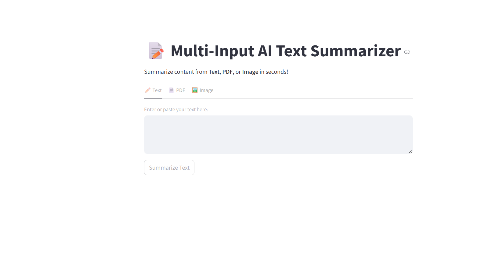

# Text_Summarizer_Project

A multi-input **AI Text Summarizer** built with **Python**, **Streamlit**, and **Hugging Face Transformers**.for
I actually built this project as my academic AI project.

This app allows you to:
- 🔹 Summarize plain **text input**
- 🔹 Summarize text extracted from **PDF files**
- 🔹 Summarize text extracted from **images** using OCR (Tesseract)

---

## 🌟 Features

- 🧠 AI-powered summarization using Hugging Face Transformers
- 📄 Extracts text from PDFs using PyPDF2
- 🖼️ Extracts text from images using pytesseract (OCR)
- 🎯 Simple and interactive web interface using Streamlit
- 🧩 Handles long texts by auto-chunking

---

## 📸 Screenshots

Author
Sakshi Shinde
